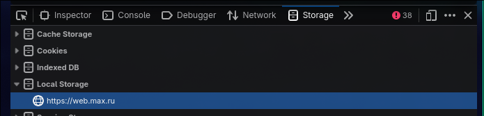

# web.max.ru parser

## Install
```bash
python -m venv
source venv/bin/activate
pip install -r requirements.txt
```

## Configuring
**Через devtools:**
Откройте `web.max.ru`, войдите в свой аккаунт, откройте devTools->`Storage`->`Local Storage`:

Скопируйте значение `__oneme_auth` и запишите его в `.env` как `ONEME_AUTH` в одиночных кавыках, скопируйте `__oneme_device_id` и запишите как `ONEME_DEVICE_ID` можно без кавычек.

**Автоматически:**
Чтоб вообще не париться можете запустить это в `tampermonkey`:
```js
// ==UserScript==
// @name         max .env copier
// @namespace    http://tampermonkey.net/
// @version      1.0
// @description  Копирует в буффер обмена данные сессии max
// @author       MitrichevGeorge
// @match        https://web.max.ru/
// @icon         https://www.google.com/s2/favicons?sz=64&domain=max.ru
// @grant        GM_registerMenuCommand
// @grant        GM_setClipboard
// ==/UserScript==


(function() {
    'use strict';

    function myCustomAction() {
        const __oneme_auth = localStorage.getItem('__oneme_auth');
        const __oneme_device_id = localStorage.getItem('__oneme_device_id');

        if (!__oneme_auth || !__oneme_device_id) {
            alert('Данные не найдены');
        } else {
            const dataToCopy = `ONEME_DEVICE_ID=${__oneme_device_id}\nONEME_AUTH='${__oneme_auth}'`
            try {
                GM_setClipboard(dataToCopy, "text");
                alert('Данные успешно скопированы');
            } catch (err) {
                alert(`Ошибка при копировании: ${err}`);
            }
        }
    }

    GM_registerMenuCommand("Скопировать значения для .env", myCustomAction);

})();
```

### Disclaimer and Terms of Use

#### 1. "AS IS" Warranty Disclaimer
This software is provided **"AS IS"** and **"WITH ALL FAULTS."** The author makes no representations or warranties of any kind concerning the safety, suitability, lack of viruses, inaccuracies, typographical errors, or other harmful components of this software. 
There are inherent dangers in the use of any software, and you are solely responsible for determining whether this software is compatible with your equipment and other software installed on your equipment. You are also solely responsible for the protection of your equipment and backup of your data, and the author will not be liable for any damages you may suffer in connection with using, modifying, or distributing this software.

#### 2. Limitation of Liability
In no event shall the author be liable to you or any third parties for any special, punitive, incidental, indirect, or consequential damages of any kind, or any damages whatsoever, including, without limitation, those resulting from loss of use, data, or profits, whether or not the author has been advised of the possibility of such damages, and on any theory of liability, arising out of or in connection with the use or performance of this software.

#### 3. No Affiliation
This project is an independent, open-source utility. The author is **NOT** affiliated, associated, authorized, endorsed by, or in any way officially connected with:
* **max** (or `web.max.ru`)
* **Tampermonkey**

All product and company names, logos, and brands are trademarks™ or registered® trademarks of their respective holders. Use of them does not imply any affiliation with or endorsement by them.

#### 4. Account Ban & Usage Risks
By using this parser, you acknowledge and agree that:
* Automated scraping, parsing, or access to `web.max.ru` may violate their Terms of Service (ToS).
* The use of this software **may result in the permanent ban, suspension, or termination of your account** on `web.max.ru`.
* The author takes zero responsibility for any enforcement actions taken against your account.

#### 5. Security Warning (.env File)
This tool relies on injecting active session tokens, cookies, or credentials into a local `.env` file. 
* **CRITICAL RISK:** If you mishandle, leak, or accidentally commit your `.env` file to a public repository (e.g., GitHub), **third parties can steal your session and fully compromise your account.**
* You are entirely responsible for securing your configuration files and keeping your authentication tokens private.

---
**By cloning, downloading, or using this repository, you explicitly agree to all terms stated above.**